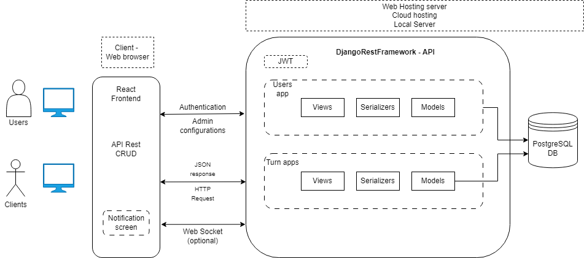

# Architecture

  * SO: Linux o Windows
  * Application type: WEB
    * Backend: Python (DJango Rest Framework)
    * Frontend: React JS
  * Database: PostgreSQL, ORM: Django
  	

## Sequence diagram

