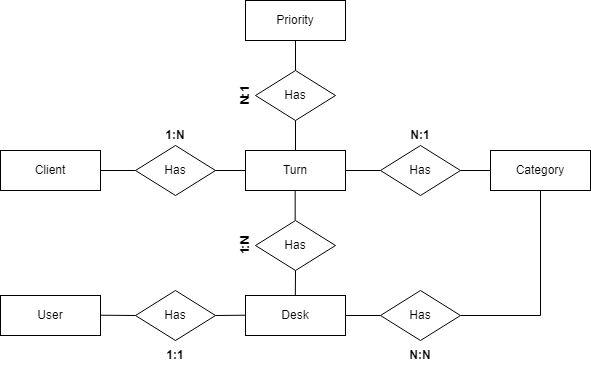

# Entity Relationship Diagram

1. __"Client" table__: information of clients who request turns. 

    | Field     | Type        | Description                           |
    |-----------|-------------|---------------------------------------|
    | id(pk)    | INT         | Unique and auto-generated register id |
    | id_type   | ENUM        | Identification type: cc, pp, ppt, ti  |
    | id_number | VARCHAR     | Client's personal identification      |
    | ...       | ...         | ...                                   |    

2. __"User" table__: System administrators information

    | Field        | Type   | Description                                           |
    |--------------|--------|--------------------------------------                 |
    | id(pk)       | INT    | Unique and auto-generated register id                 |
    | user_name    | VARCHAR| User name                                             |
    | first_name   | VARCHAR| User first name                                       |
    | last_name    | VARCHAR| User last name                                        |
    | is_admin     | BOOL   | Administrator email                                   | 
    | is_active    | BOOL   | Indicate if user account is active and can login      |
    | is_staff     | BOOL   | indicates if user has access to the Django admin panel|
    | password     | VARCHAR| Access password                                       |
    | email        | VARCHAR| User email                                            |
    | ...          | ...    | ...                                                   |

3. __"Priority" table__: Different turn priorities offered, such as "urgent", "preferential", "general".

    | Field        | Type        | Description                              |
    |--------------|-------------|--------------------------------------    |
    | id           | INT         | Unique and auto-generated register id    |
    | name         | VARCHAR     | Descriptive priority name                |
    | priority     | INT         | Customer Service Priority Level(0 to 20) |
    | description  | VARCHAR     | Detailed priority description            |
    | ...          | ...         | ...                                      |

4. __"Category" table__: different categories of turns offered, such as "General", "Authorizations, Bill Payment".

    | Field        | Type        | Description                           |
    |--------------|-------------|---------------------------------------|
    | id           | INT         | Unique and auto-generated register id |
    | name         | VARCHAR     | Descriptive category name             |
    | description  | VARCHAR     | Detailed category description         |
    | ...          | ...         | ...                                   |

5. __"Desk" table__: information about the different service desks to which turns can be assigned

    | Field       | Type    | Description                                                   |
    |-------------|---------|-----------------------------------------                      |
    | id          | INT     | Unique and auto-generated register id                         |
    | user(FK)    | INT     | Assigned user to the service desk (User table)                |
    | category(FK)| INT     | Categories associated with the service desk (Category table)  |
    | name        | VARCHAR | Service desk name                                             |
    | state       | BOOL    | Indicates if the service desk is available or not             |
    | busy        | BOOL    | Indicates if someone is being served to in the service desk   |
    | ...         | ...     | ...                                                           |

6. __"Turn" table__:  details of each turn requested by a client

    | Field           | Type    | Description                                           |
    |--------------   |---------|------------------------------------------------------ |
    | id              | INT     | Unique and auto-generated register id                 |
    | turn_number     | VARCHAR | Four character turn number                            |
    | personal_id(FK) | INT     | Client's personal identification (Client table)       |
    | category(FK)    | INT     | Category associated with the client (Category table)  |
    | priority(FK)    | INT     | Priority associated with the client (Priority table)  |
    | desk(FK)        | INT     | Service desk where the client is served               |
    | created         | DATETIME| Turn assignment date and time                         |
    | start_time      | TIME    | Client service start time                             |
    | end_time        | TIME    | Client service end time                               |
    | duration        | DATETIME| Client service duration (minutes)                     |
    | waiting time    | DATETIME| Client waiting time to be served (minutes)            |
    | state           | ENUM    | (e.g. "pending", "serving", "served", first to serve, |
    | ...             | ...     | "canceled")                                           |

7. __"TurnConfig" table__:  restart turn number configuration

    | Field           | Type    | Description                                            |
    |--------------   |---------|--------------------------------------------------------|
    | id              | INT     | Unique and auto-generated register id                  |
    | restart_turn    | BOOL    | Indicates if turn creation sequence will be initialized|

---

(Optional)

8. __"Permission" table__: Different permissions that users can have in the application => manage_users, create_turns, serve_turns 

    | Field        | Type        | Description                                   |
    |--------------|-------------|-----------------------------------------------|
    | id           | INT         | Unique and auto-generated register id         |
    | name         | VARCHAR     | Descriptive permission name                   |
    | description  | VARCHAR     | Detailed permission description               |
    | ...          | ...         | ...                                           |

- DRF automatically makes the pivot tables in many-to-many relationships

9. __"users_permissions" (pivot table)__ : many-to-many relationship between users and permissions, and stores the permissions assigned to each user

    | Field         | Type | Description                                     |
    |-------------- |------|-----------------------------------------------  |
    | id            | INT  | Unique and auto-generated register id           |
    | user(FK)      | INT  | Assigned user to a permission (User table)      |
    | permission(FK)| INT  | Assigned permission to a user (Permission table)|
